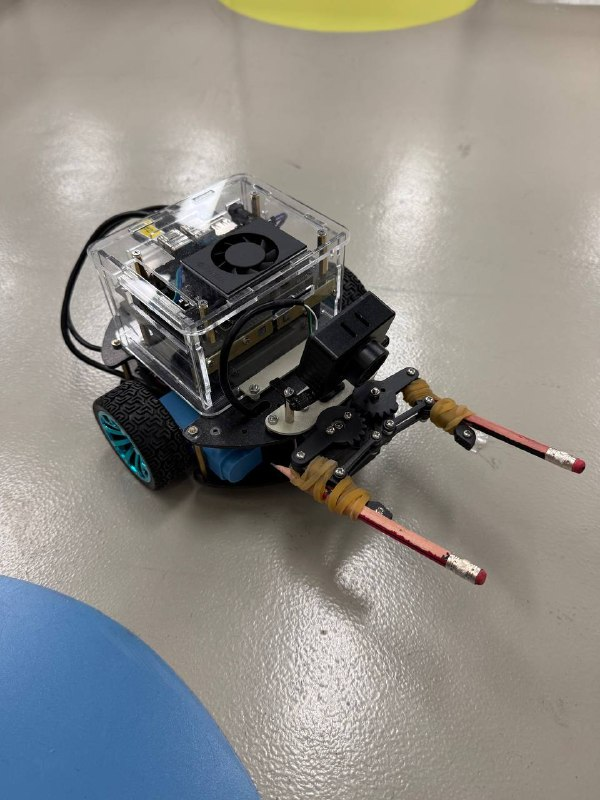
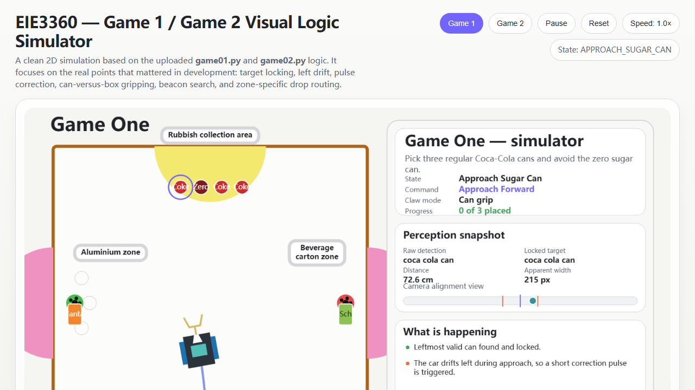

# Edge-Deployed Object Detection and Autonomous Waste Sorting Robot

  
  
  
  

  

This repository documents my EIE3360 final project work on an autonomous waste-sorting robot built for two real-world mini-games under course competition constraints. The system combined onboard YOLOv11 detection on Jetson Orin, STM32-based actuation, custom task-state control, and low-cost mechanical redesign to complete autonomous sorting without human intervention after start.

This is a **showcase repository**: it is designed to present the engineering outcome, implementation quality, and final results clearly on GitHub. It is not intended to be a turnkey reproduction package.

[Full Report](EIE3360_Final_Project_Report_Group24.pdf) • [Visual Simulator](eie_3360_visual_simulator.html) • [Game One Code](game01.py) • [Game Two Code](game02.py)

## Snapshot

- Achieved **full marks** in the Week 13 final demonstration.
- Ran **real-time onboard inference at about 20-40 FPS** on Jetson Orin.
- Trained and deployed a **10-class YOLOv11 detector** exported as a TensorRT engine.
- Implemented reusable autonomous logic for **two different sorting games**.
- Solved critical real-robot issues through **hardware and software co-design**, not model tuning alone.

## What This Robot Does

### Game One

The robot searches the rubbish area, identifies regular Coca-Cola cans, avoids Coca-Cola No Sugar, grasps valid cans, and places three cans upright into the left aluminium zone.

### Game Two

The robot sorts mixed objects by material:

- Coca-Cola cans and Sprite cans go to the **left aluminium zone**
- Vita Lemon Tea and Vita Soybean Drink boxes go to the **right beverage-carton zone**

The final system used green and red beacon markers as visual references for reliable delivery instead of relying only on dead reckoning.

## System Overview

The deployed loop was:

1. onboard camera captures the arena view
2. Jetson Orin runs YOLOv11 inference
3. Python state-machine logic selects targets and decides motion
4. control commands are sent to STM32 for wheel and gripper actuation
5. the robot re-observes the arena after each motion segment and updates the next action

This mattered because the final system was built around **closed-loop behaviour in a real arena**, not offline detection performance alone.

## Showcase Assets

### Visual logic simulator

The repository includes a polished browser-based simulator that visualises the real task logic implemented in the Python scripts.

  

Open [eie_3360_visual_simulator.html](eie_3360_visual_simulator.html) to view a logic-level simulation of the robot behaviour, including:

- left-to-right target selection
- target locking during close approach
- correction pulses for alignment
- separate can and box handling
- beacon search and delivery
- multi-route drop planning

## Engineering Highlights

### 1. Edge AI deployment

The perception pipeline was trained with YOLOv11 and deployed onboard as a TensorRT `.engine` model. Rather than treating detection as an offline exercise, the final system was tuned around real arena behaviour, camera perspective, and timing-sensitive motion control.

### 2. Real robot state-machine control

Both `game01.py` and `game02.py` implement full task-state control, not just simple object-following. The logic includes search, approach, grasp, retreat, beacon acquisition, delivery, reorientation, and finish conditions.

Notable software strategies included:

- confidence tuning per game
- target locking to prevent close-range target switching
- proxy tracking when only part of a target remained visible
- family-specific grasp settings for cans versus boxes
- multi-column or multi-route placement to avoid knocking over earlier drops
- repeated re-observation after each motion segment

### 3. Mechanical redesign under real constraints

The strongest lesson from the project was that embedded AI performance depended on mechanics as much as model quality. Major improvements included:

- drilling new chassis holes to eliminate wheel jamming
- repositioning motors outward to restore reliable motion
- removing claw sleeves to improve can entry
- adding two pencils and four rubber bands to widen the gripper for box handling

This low-cost claw modification made it possible to handle both cans and cartons with one robot.

## Selected Engineering Problems

| Problem | Why it mattered | Final solution |
| --- | --- | --- |
| Wheel jamming inside chassis | The robot could not move reliably enough for any autonomous task | Drilled new holes and repositioned motors outward |
| Close-range class flicker near can tops | The robot could switch targets at the worst possible moment | Added target locking and proxy tracking |
| One claw had to handle both cans and boxes | A single grasp geometry was not reliable for both object families | Removed sleeves and extended the claw with pencils and rubber bands |
| Repeated drops could knock over earlier placements | Later deliveries could reduce score even after successful grasping | Used beacon-guided multi-route drop planning |
| Good offline metrics still failed in the arena | Real performance depended on motion drift, camera angle, and battery state | Tuned thresholds and control logic through repeated full-field tests |

## Key Results

| Item | Result |
| --- | --- |
| Final demonstration | Full marks |
| Deployment platform | Jetson Orin + onboard camera + STM32 control |
| Detector | YOLOv11, exported to TensorRT |
| Dataset version | v9 |
| Dataset size | 3,275 images |
| Classes | 10 |
| Training setup | 640x640, batch 16, 100 epochs |
| Offline best precision | 0.9875 |
| Offline best recall | 0.9901 |
| Offline best mAP50 | 0.9911 |
| Offline best mAP50-95 | 0.9813 |
| Robot-side inference speed | About 20-40 FPS |

## My Contribution

This was a two-member project with an officially recorded **50/50 workload split**. My contribution covered the full engineering loop rather than a single isolated module. Based on the final report, my work included:

- image collection in the real lab environment
- dataset expansion and annotation refinement
- YOLO training and model iteration
- Jetson-side deployment and testing
- robot tuning and debugging in the arena
- software debugging and state-machine refinement
- report drafting and project documentation

What I am most proud of in this project is not only the final score, but the way the system matured from an early baseline into a reliable embedded robot through repeated diagnosis, redesign, and field testing.

## Repository Guide

- [game01.py](game01.py): autonomous logic for Game One
- [game02.py](game02.py): autonomous logic for Game Two
- [eie_3360_visual_simulator.html](eie_3360_visual_simulator.html): interactive visual explanation of the control logic
- [EIE3360_Final_Project_Report_Group24.pdf](EIE3360_Final_Project_Report_Group24.pdf): full final report

## Report

The full report is included here:

- [EIE3360 Final Project Report (PDF)](EIE3360_Final_Project_Report_Group24.pdf)

The report documents the methodology, dataset growth, hardware redesign, implementation details, evaluation results, and final demonstration outcome.

## Notes

- This repository is shared as a **showcase project**, so some hardware-specific runtime dependencies are not included.
- The Python scripts depend on a local robot-control library and a deployed YOLO TensorRT model used on Jetson.
- The included code and report are meant to demonstrate system design, implementation quality, and project outcome rather than provide one-click reproducibility.

## Acknowledgement

This project was completed for **EIE3360 Integrated Project** at **The Hong Kong Polytechnic University** as a two-person team project.
